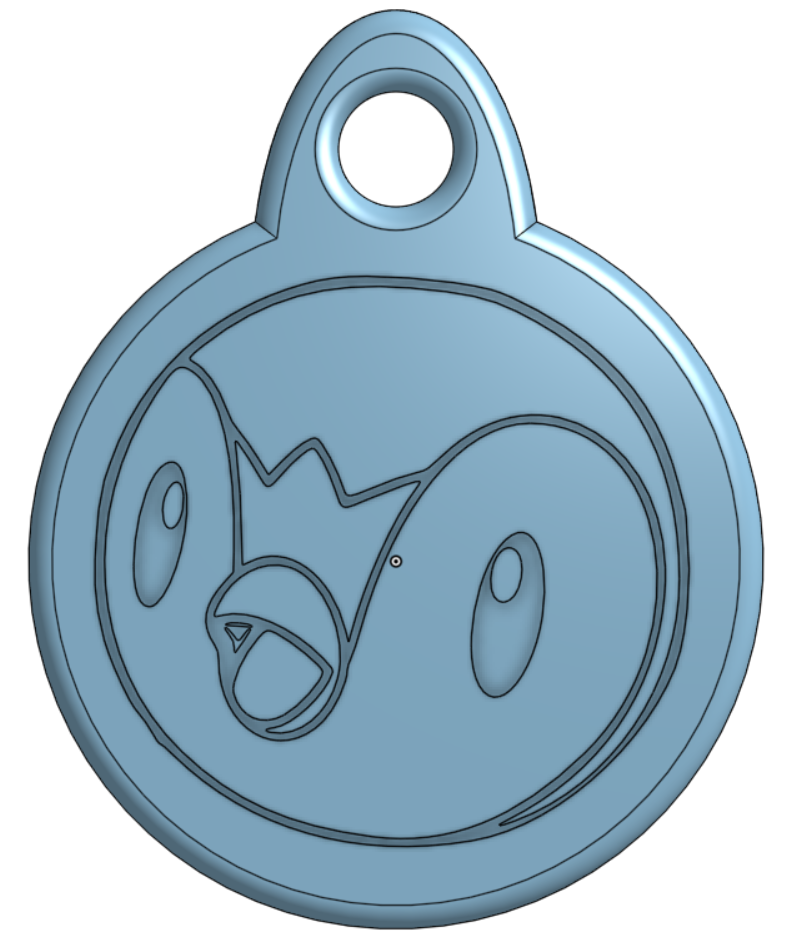
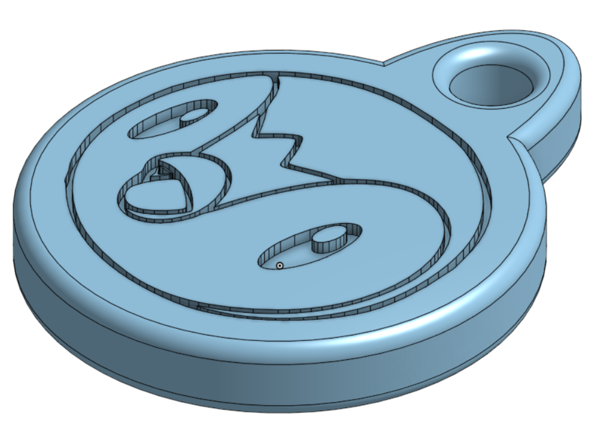
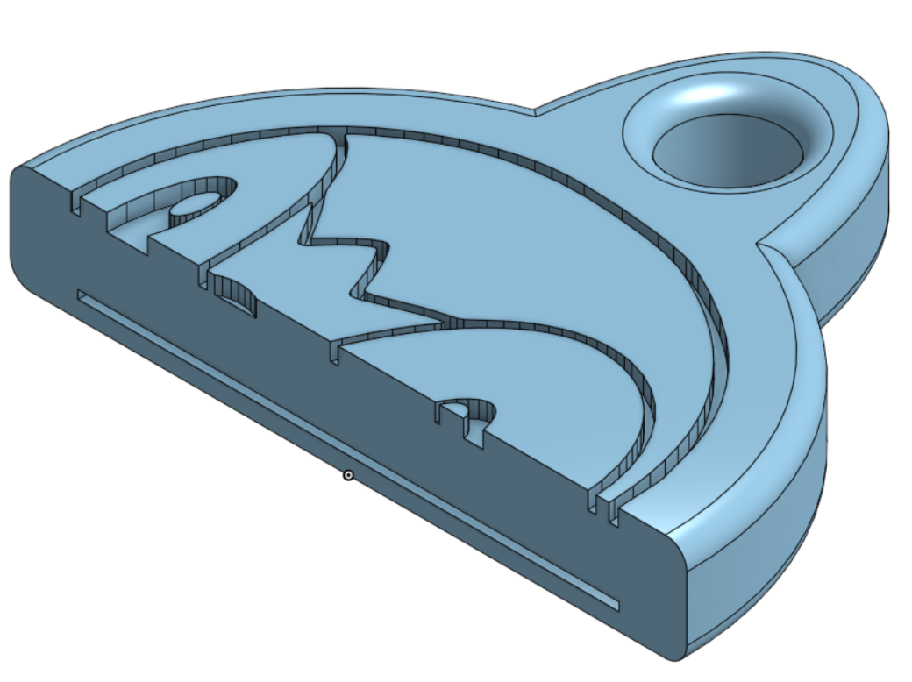

# pipl's NFC Keytag

Real nice and simple keytag designed in OnShape in ~1hr in call  
Gap is left at 0.8mm to allow for 1in (25.4mm) diameter nfc tag, gap is 0.4mm tall.  
Total keytag height is 5mm

piplup's Slack id: `U07V3MD8BPW`

