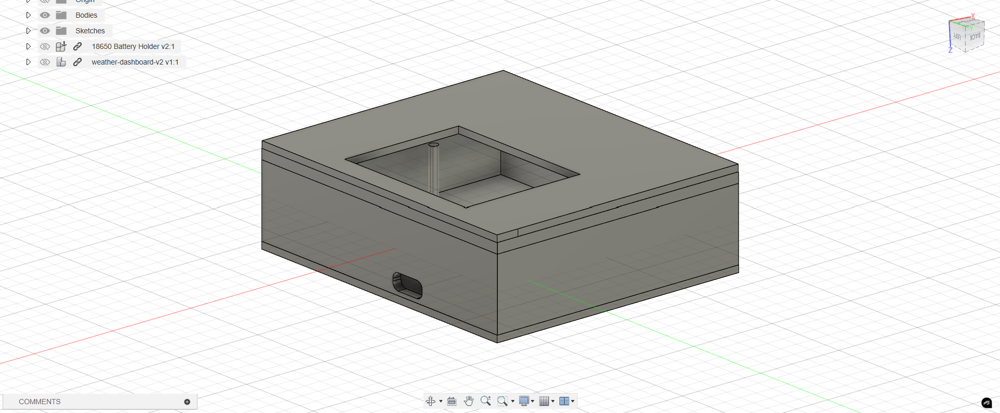
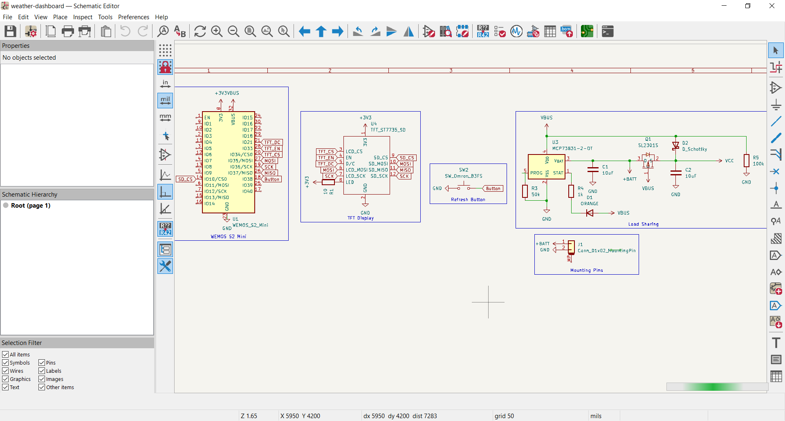
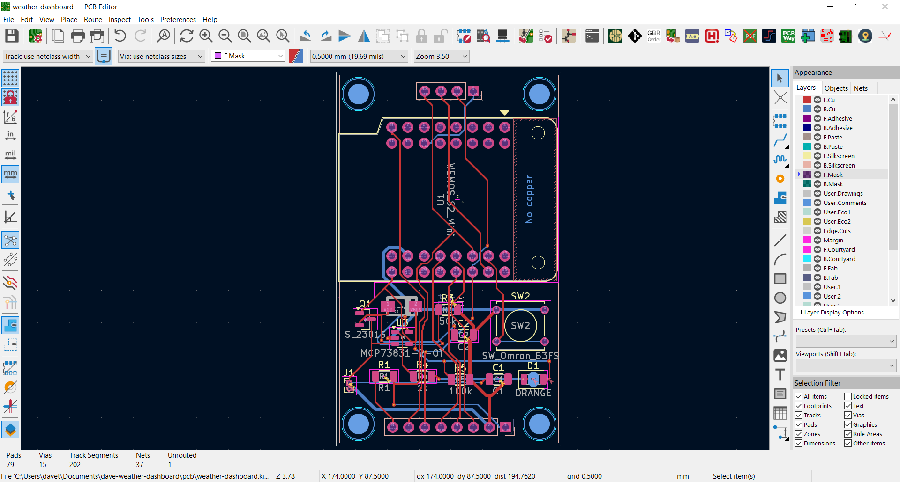

# Dave's Weather Dashboard

This is a weather dashboard I made.

## Features

- Fetching from BMKG's API
- Displays: Weather information

## Firmware Overview

The firmware is located in the [firmware folder](./firmware) made using [PlatformIO](https://platformio.org/). To open using PlatformIO, open the [firmware](./firmware).

## CAD Model

The design was made using [Autodesk Fusion](https://www.autodesk.com/education/edu-software/fusion) is located in the [cad folder](./cad).

## PCB

The PCB was made using [KiCad](https://www.kicad.org/) 8.99 located in the [pcb folder](./pcb).

Schematic | PCB
:-:|:-:
 | 

## BOM

- 2x 10 uF 1210 3216(mm) SMD Capacitor
- 1x 18650 Li-ion Battery
- 1x WEMOS S2 Mini
- 1x Resistor SMD 1206 3216(mm) 50k Ohm
- 1x Resistor SMD 1206 3216 (mm) 10 Ohm
- 1x Resistor SMD 1206 3216 (mm) 1k Ohm
- 1x Resistor SMD 1206 3216 (mm) 100k Ohm
- 1x SL2301S SOT-23 MOSFET
- 1x LED SMD 1206
- 1x 18650 Battery Holder
- Solder