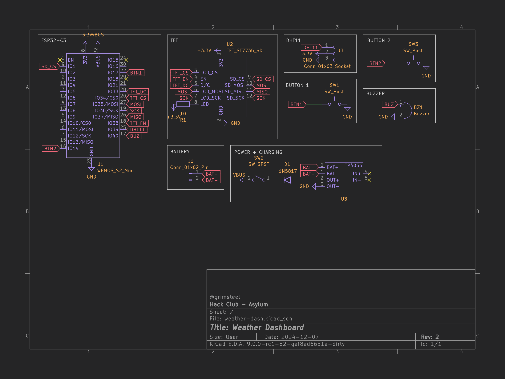
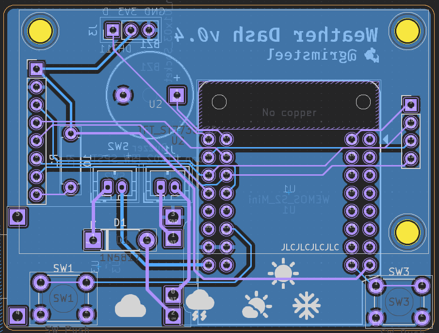
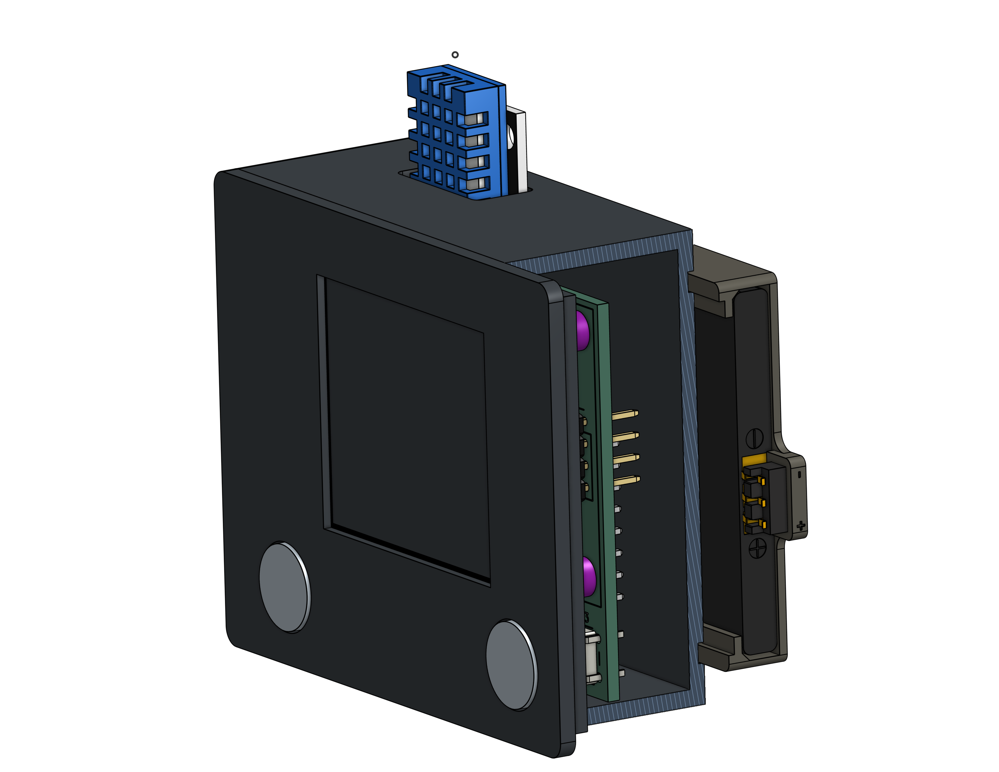

# grimsteel's weather station

## Features:
- Displays:
    - Weekly weather
    - Data from Home Assistant (soon)
- DHT11 sensor
- Two buttons
- Battery powering + charging
- Buzzer

## PCB
Here's a picture of my schematif! 

Schematic            |  PCB
:-------------------------:|:-------------------------:
  |  

*I'm using a WeMos ESP32-S2 module because of the added pins!*

[x] I ran DRC in KiCad and have made sure there are 0 errors!

## CAD Model:

The PCB is fastened using 3 M3 Heatset inserts and 3 M3 screws.
The case itself snaps together.

## Firmware overview

The firmware is written using ESP-IDF. It gets all data from Home Assistant

[x] I remembered to exclude any personal information, including API Keys, WiFi passwords, etc

## BOM
All prices must be in USD.

**Provided by dari // alex**:
- 1x WeMos S2 Mini WITHOUT FEMALE HEADERS
- 1x ST7735 1.8" LCD display WITHOUT FEMALE HEADERS. Male headers soldered!

**I will be sourcing the following parts with my grant**:
- 1x PCB from JLCPCB
    - $2 for 5x + $1.50 shipping
- 2x JST PH-2.0 connector + wires/plug [Aliexpress](https://www.aliexpress.us/item/3256806041370367.html) $1.08 (includes 5)
- 1x 3 pin SPDT switch - 0.5A [Aliexpress](https://www.aliexpress.us/item/2255800513009332.html) $0.84 (includes 10)
- 1x 1N5817 diode [Aliexpress](https://www.aliexpress.us/item/3256801365779334.html) $1.01 (includes 50)
- 1x TP4056 board [Aliexpress](https://www.aliexpress.us/item/3256804241424963.html) $1.29 (includes 5)
- 2x Tactile button cap - gray [Aliexpress](https://www.aliexpress.us/item/2251832842559353.html) $2.89 (includes 20)
- 3x M3/4.5mm, 3.5mm long Heatset Inserts  [Aliexpress](https://www.aliexpress.us/item/3256803396040989.html) $1.86 (includes 50)
- M3 heatset insert soldering iron tip [Aliexpress](https://www.aliexpress.us/item/3256806515637370.html) $2.37
- 1x 3pin Battery Spring compression contact (BC-35-3P) [Aliexpress](https://www.aliexpress.us/item/2255800016944760.html) $2.28 (includes 5)

**Total before tax**: $13.62 (all items are eligible for free shipping)

**I'll also be source the following parts myself since I already have them and would like to help Hack Club**:
- 1x 3D printed case
- 1x DHT11 board
- 2x 12mm push button
- 1x 10 ohm resistor
- 1x 1x3 female header (DHT11)
- 2x 2x8 male header (WeMos)
- 1x buzzer
- 1x Li-ion battery
